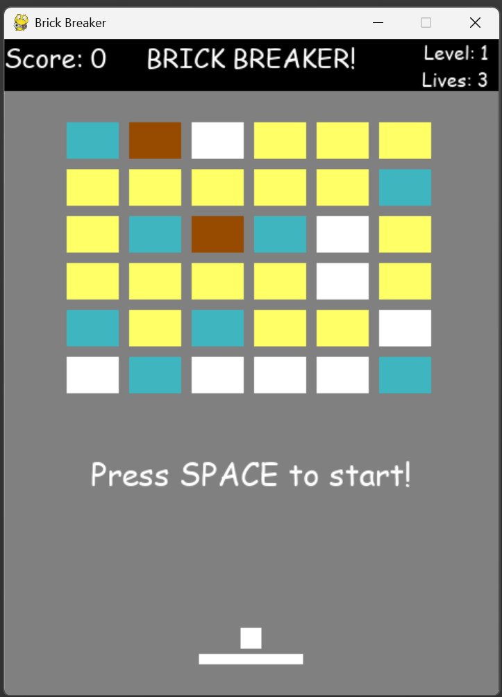
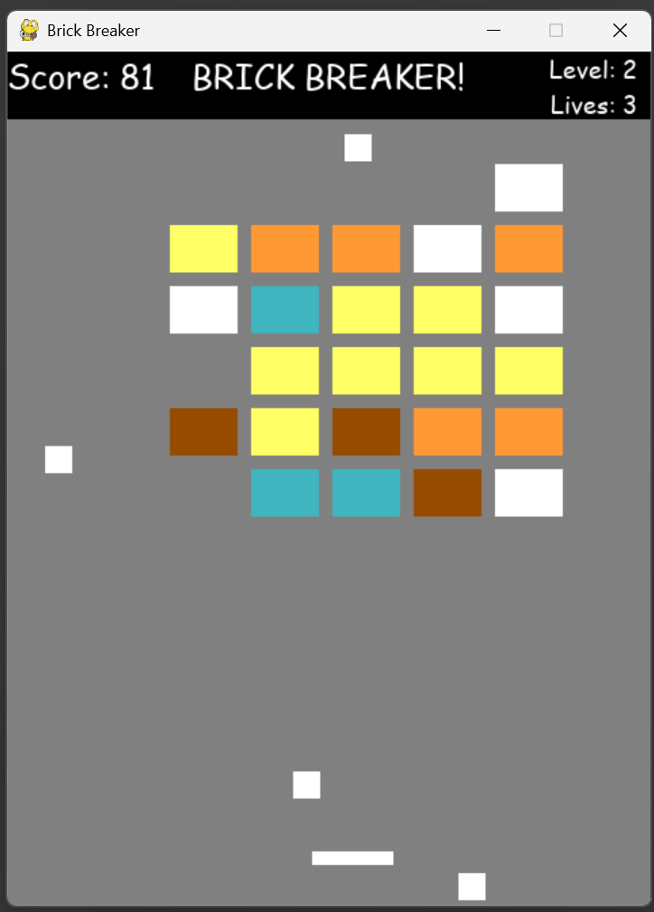

# Brick Breaker
A 2D Brick Breaker game built in Python with PyGame. The game features real-time rendering, responsive paddle controls, multiple levels, increasing difficulty, and randomized power-ups that alter gameplay.

## Features
- Control the paddle with responsive movement to keep balls in play
- Break bricks with varying durability that may require multiple hits
- Progress through increasingly difficult levels with faster ball speeds and more durable bricks
- Handle collisions between balls, the paddle, bricks, and screen boundaries
- Collect randomized power-ups and power-downs that increase or decrease paddle size
- Trigger multi-ball gameplay by destroying special brown bricks that spawn an additional ball

## Screenshots

### Start of the Game


### Mid-Game


The player has a shorter paddle from collecting a power-down and numerous extra balls have spawned from destroying brown bricks.

## Technologies Used
- Python
- Pygame
- Object Oriented Programming (OOP)

## Requirements and Running the Program
Ensure that Python is installed on your system.

Install PyGame if it is not already installed:
```
pip install pygame
```

To play the game, run the file `main.py` 

## Rules
Use left arrow key or "a" to move the paddle left, and use right arrow key or "d" to move the paddle right. The objective is to keep the ball in play and destroy all bricks in each level. If all balls fall below the bottom of the screen, the player loses one life.

The player starts with **three lives**. To advance to the next level, all bricks in the current level must be destroyed. There is no fixed final level, so the game continues with increasing difficulty as long as the player has lives remaining.

## Game Mechanics

### Bricks Durability
Bricks have different durability levels and may require multiple hits before being destroyed. The brick color indicates the number of hits required:
- White bricks = 1 hit
- Yellow bricks = 2 hits
- Orange bricks = 3 hits
- Red bricks = 4 hits

After being hit, a brick changes color to indicate its remaining durability.

### Power-Up System
Certain bricks trigger special effects when destroyed.
- **Brown bricks** spawn an additional ball, enabling multi-ball gameplay and helping the player clear levels faster.
- **Cyan bricks** randomly spawn either a power-up or a power-down:
  - **Power-up:** A falling green square that increases the paddle size when collected.
  - **Power-down:** A falling purple rectangle that decreases the paddle size when collected.

## Project Structure
```text
Brick-Breaker/
├── Images/
│   ├── game_start.png
│   └── game_middle.png
├── ball_sprite.py
├── brick.py
├── main.py
├── my_sprite.py
├── paddle_length_power_up.py
├── paddle_sprite.py
├── text_sprite.py
├── upper_block.py
├── window.py
└── README.md
```